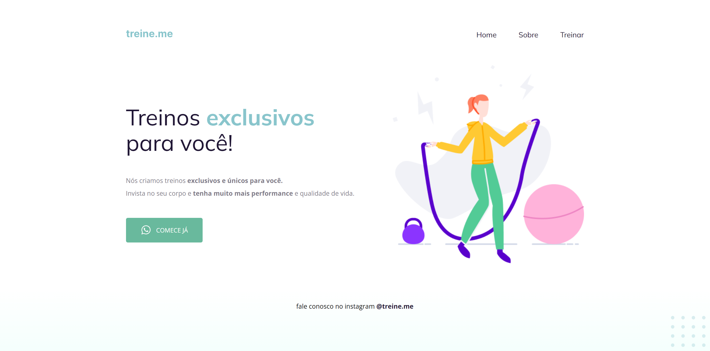

# Desafio da fase 02
## Corrigindo bugs :bug:
### Sobre o desafio

Nesse desafio, você receberá um código com o projeto desenvolvido durante as aulas da Fase 02.

E, novamente, a surpresa (não tão surpresa assim) vem aí... **👀**  

O código sofreu algumas alterações nos principais pontos abordados nessa fase e, como podemos ver na imagem abaixo, ele não está mais da mesma forma que o Maykão deixou.

Topa encarar esse desafio e deixar o site com a mesma carinha de antes? 💜
Vai ser muito importante para o seu aprendizado rever e aplicar esses novos conceitos. 

<u>Lembrando:</u> tente se desafiar e não olhar a resposta mas, caso apareça alguma dificuldade, você pode voltar nas aulas e rever a maneira com que foi desenvolvido!

### Desafio concluído
Código foi arrumado de maneira que o site ficasse igual ao que foi apresentado durante as aulas e igual ao que está no [Figma](https://www.figma.com/file/rkDOHGPwwFtBNqEdHSuQPd/Projeto-02---Explorer?node-id=0%3A1).

